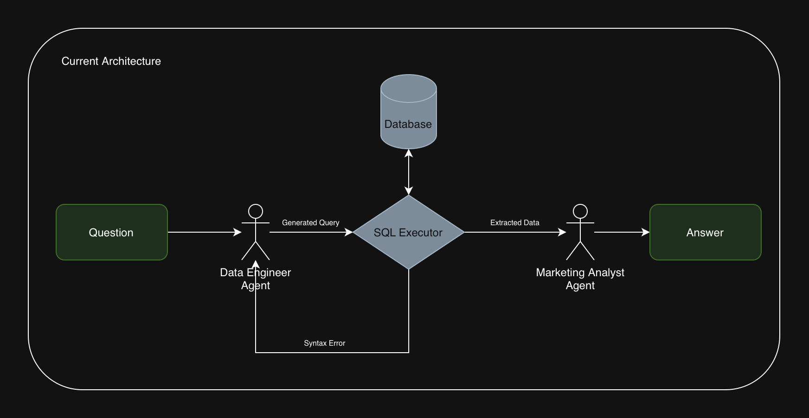
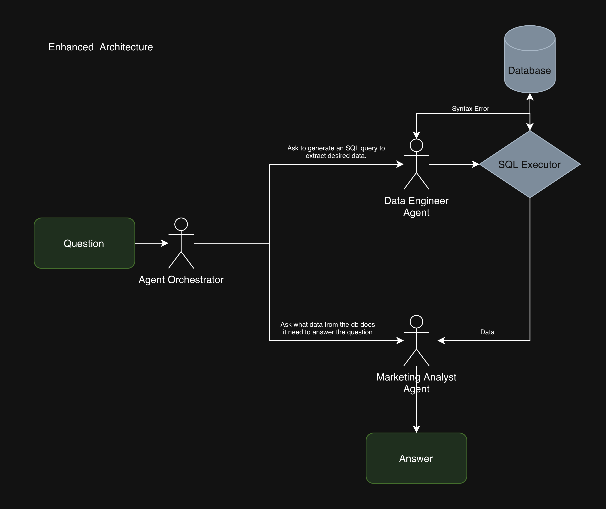

# Як запустити?

1. Треба створити `.env` за наступними API ключами: GOOGLE_API_KEY, TELEGRAM_BOT_API_TOKEN.
2. Зробити `uv sync` (встановити `uv` якщо ще немає [тут](https://docs.astral.sh/uv/getting-started/installation/))
3. Запустити через `uv run agent.py`.

# Характеристики креативів

## Характеристики відео/зображень (AgentOutputContentCharacteristics)
Ця група полів аналізує структуру та психологічні тригери самого відео або зобреження.

1. Хук

`content_hook (Текст/концепція зачіпки)`: Перший елемент, що змушує користувача зупинити гортання стрічки (scroll-stopper). Зазвичай апелює до конкретної проблеми (наприклад, «соматичні вправи проти жиру на животі») або створює інтригу.

`content_hook_length_seconds (Тривалість зачіпки)`: Точний хронометраж початкового хука. Для утримання уваги це зазвичай короткий інтервал від 1 до 5 секунд, де чітко артикулюється головна цінність.

`content_hook_visual_format (Візуальний формат)`: Естетична подача хука. Визначає, що саме використовується: порівняння на розділеному екрані (split-screen), «живі» UGC-кадри (контент від звичайних користувачів) чи графічні інформаційні шари (overlays).

`content_hook_type (Тип хука)`: Психологічний механізм початку відео. Це може бути діагностичне питання про тіло користувача, парадоксальний/шокуючий факт або демонстрація швидкої трансформації «до/після».

`content_hook_emotional_valence (Емоційне забарвлення)`: Початковий емоційний настрій відео. Визначає, чи починається ролик з нагнітання проблеми («Біль/Роздратування»), чи одразу пропонує натхненне рішення («Прагнення до полегшення»).


2. Ціннісна пропозиція (Value)

`content_product_value_type (Тип цінності продукту)`: Головна обіцянка реклами («навіщо це мені?»). Фокусується на кінцевому результаті (трансформація) або на зручності стилю життя (наприклад, легкість виконання вправ без спортзалу).

`content_body_logic_type (Логіка викладу)`: Риторична стратегія для побудови довіри та подолання скепсису. Може використовувати освітній розбір (пояснення науки про кортизол/соматику) або соціальний доказ (результати реальних користувачів).

3. Заклик до дії (CTA)

`content_cta (Текст заклику до дії)`: Фінальна пряма вказівка чи команда наприкінці відео. Базується на терміновості або цікавості, наприклад: «Пройди тест», «Забери свій план на 28 днів» чи «Почни пробний період за $1».

`content_cta_type (Тип заклику до дії)`: Стратегічна класифікація цілі конверсії: переспрямування користувача на інтерактивну діагностику (квіз) чи на миттєве оформлення підписки/тріалу.

4. Загальні параметри

`pacing (Темп/Динаміка)`: Швидкість, з якою відео взаємодіє з користувачем і подає інформацію.

## Характеристики тексту публікації (AgentOutputPostTextCharacteristics)
Ця група аналізує копірайтинг — текст (caption), який супроводжує відео у публікації. Структура дублює логіку відео, але націлена на текстове сприйняття.

1. Текстовий хук (Post Hook)

`post_hook (Перший рядок)`: Текст-зачіпка на початку опису. Зазвичай це смілива заява або опис знайомої користувачу проблеми (наприклад, «Досить боротися зі своїм тілом»), мета якої — змусити натиснути кнопку «Читати далі» (See More).

`post_hook_type (Тип текстового хука)`: Риторична структура початку тексту. Наприклад, шокуючий факт про метаболізм або запитання, таргетоване на конкретний архетип (наприклад, «Для зайнятих професіоналів»).

`post_hook_emotional_valence (Емоційне забарвлення тексту)`: Точка емоційного входу. Часто починається з емпатичного опису болю чи втоми, щоб вибудувати зв'язок із читачем перед пропозицією рішення.

2. Цінність у тексті (Post Value)

`post_product_value_type (Тип цінності в тексті)`: Обіцянка, закладена в тілі тексту (наприклад, акцент на трансформації або на тому, що вправи можна робити «прямо в піжамі»).

`post_body_logic_type (Логіка текстового викладу)`: Аргументація та докази в тексті. Часто реалізується через списки (bullet points), що пояснюють фізіологічні чи психологічні переваги застосунку (наприклад, регуляція кортизолу).

4. Текстовий заклик до дії (Post CTA)

`post_cta (Текст фінальної інструкції)`: Фінальний заклик у тексті, часто підсилений емодзі та дедлайном, наприклад: «Тисни нижче, щоб дізнатися свій метаболічний вік ⬇️».

`post_cta_type (Тип текстового CTA)`: Категорія конверсії для тексту — перехід на проходження тесту (квізу) чи пряма конверсія на обмежену в часі пропозицію.

## Алгоритмічні метадані (AlgorithmicMetadata)
Технічні та статистичні параметри публікації, необхідні для системної аналітики та збереження в БД:

`published (Статус публікації)`: Чи було оголошення опубліковано (True/False).

`content_id (Ідентифікатор контенту)`: Унікальний числовий ID креативу.

`content_type (Тип контенту)`: Категорія контенту за внутрішньою класифікацією.

`content_format (Формат контенту)`: Опис формату (наприклад, розміри, співвідношення сторін або платформа).

`product (Продукт)`: Назва продукту або застосунку, який рекламується.

`date_published (Дата публікації)`: Дата, коли креатив став активним.

`reach (Охоплення)`: Кількість унікальних користувачів, які побачили цю рекламу.

`post_text (Повний текст)`: Весь текст публікації (копілефт) в оригінальному вигляді.

# Яку модель було обрано і чому?
Для цього демо я обрав Google (а не OpenAI, чи Claude) за його невисоку собівартість, а також різноманіття моделей, з якими можна попрацювати.

Я протестував декілька моделей від Google:

1. **Gemma 4 31B**. Повільний API, контексту як раз вистачає на промпт + зображення або промпт + відео, але не вистачає складності моделі для побудови закономірностей між заданими характеристиками та креативами. В результаті модель часто брала не ті частини тексту з посту, чи неправильно записувала, що було сказано у відео.
2. **Gemini 2.5 Flash Lite**. Швидка, багато контексту, що дозволяє аналізувати відео довжиною більше ніж 60 секунд. Має достатню складність для аналізу закономірностей між характеристиками та креативами. Модель себе гарно показала, працювала швидко, але були проблеми з Content Value Type, та розумінням коли і де треба поставити null.
3. **Gemini 2.5 Flash**. Все те саме, що і flash lite, але вона може будувати складніші логічні зв'язки. Показала себе найкраще, бо тепер є мінімальні проблеми з Content Value Type, а також модель на достатньо гарному рівні розуміє куди поставити null.

Отже я обрав `Gemini 2.5 Flash` за швидкодію, вартість та точність.

# Prompts для отримання характеристик креативів

## З чого складається промпт?

Промпт складається з двох головних частин:
1. Преамбула. Містить в собі загальні інструкції, як, наприклад, структура відповіді, роль, рекомендації по аналізу.
2. Функціональна частина. Вона дуже тісно пов'язана з самою структурою даних, яку ми записуємо в базу даних. Тут описується, що кожна колонка в таблиці означає, які значення вона може приймати і, що кожне з цих значень у свою чергу означає.

Чому так? Ця структура дозволяє бути гнучкою в інструкціях ЯК обробляти даних, але в той самий час вона строго описує те, ЩО ми хочемо отримати від моделі, чітко описуючи значення та приклади.  

## Як відбувалось покращення промтів?

Я відібрав 10 рандомних креативів (3 зображення та 7 відео), і запускав на кожному промпті LLM для аналізу. Далі я вручну перевіряв те, наскільки гарні були відповіді та будував гіпотези, далі я робив покращення та перевіряв, чи не стало краще.

### Відбір тестового датасету

Було відібрано 10% усього датасету як "тренування". Важливо було врахувати співвідношення зображень до відео, бо відео у нас набагато більше, тож треба і приділяти більше уваги. В результаті отримано 3 зображення та 7 відео.

### Версіонування промптів

Версіювання промптів відбувається за допомогою `prompt_{prompt_version}_{commit_hash}`. При цьому створюється окрема папка з назвою "prompts". 

Чому включати в це хеш коміту? Річ у тім, що функціональна частина промпту є частиною коду, що в даному випадку забезпечує `inheritent versioning` та дозволяє не хвилюватись, що десь лежить якийсь txt файл.

### Тестування промптів

Я спочатку думав, що передивлюсь вручну всі 10 відео, але після декількох ітерацій я зрозумів, що без експертної думки моя оцінка така ж сама, що й в LLM.

Якщо коротко, то я:
1. Проганяв модель на 10 рандомних креативах
2. Дивився де, як я думав вона помилилась
3. Будував гіпотези, чому так вийшло
4. Перевіряв гіпотезу, змінюючи щось

Головні частини викладені в папці [prompts](./prompts/). Майже в кожній підпапці є `ANALYSIS.md`, в якому я описую певні проблеми, покращення та інколи гарні сторони.

## Підсумування промптів

### Гарні сторони

1. Агент правильно ідентифікує CTA та Value в постах. Гарно витягує текст (Hook) з контенту.
2. Агент розуміє емоційне спрямування поста

### Негативні сторони

1. Агент іноді помиляється при визначенні довжини хуку. Мабуть це те, як всередині воно працює, LLM просто важко визначати довжину чогось.
2. Іноді агент неправильно визначає `pacing`. Наприклад відео '870873419302426.mp4' та '1433361945187888.mp4' мають одну і ту саму основну частину, але при цьому мають `repetitive_rhythmic` та `calm_mindful` відповідно. Мені здається, що проблема в промпті, і що можна замінити на якісь інші категорії, чи підтюнити скрипт.

## Приклади аналізу

### Нульовий приклад

```json
{
    "post_cta": "Tap today.",
    "post_cta_type": "direct_conversion",
    "post_product_value_type": "frictionless_ease",
    "post_body_logic_type": "objection_handling",
    "post_hook": "⏳ I kept waiting for the “right moment” — more time, more energy, maybe a gym. It never came.",
    "post_hook_type": "transformation",
    "post_hook_emotional_valence": "pain_agitation",
    "content_cta": "Tap now to start your transformation",
    "content_cta_type": "direct_conversion",
    "content_product_value_type": "transformation_outcome",
    "content_body_logic_type": "demonstration",
    "content_hook": "THE EASIEST WAY TO SHOCK EVERYONE WHO HASN'T SEEN YOU IN MONTHS.",
    "content_hook_length_seconds": 3,
    "content_hook_visual_format": "ugc",
    "content_hook_type": "transformation",
    "content_hook_emotional_valence": "aspirational_relief",
    "pacing": "high_energy_fast",
    "published": true,
    "content_id": 951064930588755,
    "content_type": "video",
    "content_format": "9:16",
    "product": "BetterMe",
    "date_published": "2026-03-07",
    "reach": 538897,
    "post_text": "⏳ I kept waiting for the “right moment” — more time, more energy, maybe a gym. It never came. \nWhat worked was BetterMe Calisthenics 👣 \n15 min I could actually keep up with 👉 \nBig change starts small 🚀 Tap today."
}
```

Все ідеально ідентифіковано.


### Перший приклад

```json
{
    "post_cta": "Rozwiąż 1-minutowy quiz 📊",
    "post_cta_type": "assessment_entry",
    "post_product_value_type": "hyper_personalization",
    "post_body_logic_type": "educational_teardown",
    "post_hook": "Osiągnij cele związane z mięśniami💪",
    "post_hook_type": "transformation",
    "post_hook_emotional_valence": "aspirational_relief",
    "content_cta": "KLIKNIJ EKRAN, ABY DOŁĄCZYĆ!",
    "content_cta_type": "'direct_conversion'",
    "content_product_value_type": "transformation_outcome",
    "content_body_logic_type": "objection_handling",
    "content_hook": "SZUKAMY DZIEWCZYN KTÓRE NIE ĆWICZYŁY REGULARNIE i chcą osiągnąć wymarzoną sylwetkę w 2026 roku",
    "content_hook_length_seconds": null,
    "content_hook_visual_format": null,
    "content_hook_type": "transformation",
    "content_hook_emotional_valence": "aspirational_relief",
    "pacing": null,
    "published": true,
    "content_id": 2099857124146357,
    "content_type": "image",
    "content_format": "9:16",
    "product": "BetterMe",
    "date_published": "2026-03-06",
    "reach": 734709,
    "post_text": "\"Osiągnij cele związane z mięśniami💪 \nTrzymaj się tego prostego planu, aby odnieść sukces: \n1. Rozwiąż 1-minutowy quiz 📊 \n2. Uzyskaj plan ćwiczeń i posiłków oparty na wadze, wzroście, wieku, codziennej aktywności i kondycji fizycznej📲 \n3. Postępuj zgodnie z programem 😎\""
}
```

Тут правильно було ідентифіковано все. 
1. Агент правильно проаналізував текст посту, ідентифікував `Rozwiąż 1-minutowy quiz 📊` як `assessment_entry` тип CTA.
2. Агент правильно визначив CTA контенту: `KLIKNIJ EKRAN, ABY DOŁĄCZYĆ!` та `direct_conversion` тип.
3. Агент правильно ідентифікував Hook `SZUKAMY DZIEWCZYN KTÓRE NIE ĆWICZYŁY REGULARNIE i chcą osiągnąć wymarzoną sylwetkę w 2026 roku` та тип хуку `transformation`.
4. Агент неправильно ідентифікував `content_hook_visual_format`. На мою думку воно має бути `cinematic`, бо це найближче серед усіх типів. Мабуть би я додав ще тип `photorealistic`. 

### Другий приклад

```json
{
    "post_cta": null,
    "post_cta_type": null,
    "post_product_value_type": "transformation_outcome",
    "post_body_logic_type": "educational_teardown",
    "post_hook": "Your body can become the equipment. Try Calisthenics.",
    "post_hook_type": "call_to_action",
    "post_hook_emotional_valence": "diagnostic_authority",
    "content_cta": "TAP THE SCREEN TO JOIN US",
    "content_cta_type": "direct_conversion",
    "content_product_value_type": "transformation_outcome",
    "content_body_logic_type": "demonstration",
    "content_hook": "IF YOU START CALISTHENICS ON MARCH 16TH YOU'LL BE UNRECOGNIZABLE BY MAY",
    "content_hook_length_seconds": 3,
    "content_hook_visual_format": "ugc",
    "content_hook_type": "transformation",
    "content_hook_emotional_valence": "aspirational_relief",
    "pacing": "high_energy_fast",
    "published": true,
    "content_id": 1888741965847477,
    "content_type": "video",
    "content_format": "9:16",
    "product": "BetterMe",
    "date_published": "2026-03-16",
    "reach": 1107501,
    "post_text": "Your body can become the equipment. Try Calisthenics.\n\nInstead of machines and weights, this 28-day plan teaches your body to move, hold, and build strength using its own resistance.\nYou’ll develop:\n💪 Stronger arms and shoulders\n🔥 A tight, active core\n🦵 Powerful legs and glutes\n⚡ Better balance and control\n\nYour 28-Day Calisthenics Plan\n🟢 Week 1: Learn foundational bodyweight moves\n🟢 Week 2: Build control and core stability\n🟢 Week 3: Increase strength and endurance\n🟢 Week 4: Move with power and confidence\n\n🏠 No equipment needed\n⏱ Short daily sessions\n💪 Strength built with your own body\n\n✨ When your body becomes the resistance, strength feels different."
}
```

1. Правильно ідентифіковано `ugc`, `pacing`, `content_product_value_type`, `content_body_logic_type`, `content_cta`, `content_cta_type` etc.
2. Є деяка проблема з `content_hook_length_seconds`, так як Агент сказав, що воно протягом 3 seconds, однак насправді вого протягом 5 seconds.

### Третій приклад

```json
{
    "post_cta": "Inizia la trasformazione ora!",
    "post_cta_type": "assessment_entry",
    "post_product_value_type": "hyper_personalization",
    "post_body_logic_type": "demonstration",
    "post_hook": "Raggiungi i tuoi obiettivi facilmente 💪",
    "post_hook_type": "transformation",
    "post_hook_emotional_valence": "aspirational_relief",
    "content_cta": "TOCCA PER PARTECIPARE",
    "content_cta_type": "direct_conversion",
    "content_product_value_type": "transformation_outcome",
    "content_body_logic_type": "objection_handling",
    "content_hook": "CERCHIAMO UOMINI che non si allenano da anni e vogliono diventare irriconoscibili nel 2026",
    "content_hook_length_seconds": null,
    "content_hook_visual_format": "cinematic",
    "content_hook_type": "transformation",
    "content_hook_emotional_valence": "aspirational_relief",
    "pacing": null,
    "published": true,
    "content_id": 1612214663311424,
    "content_type": "image",
    "content_format": "9:16",
    "product": "BetterMe",
    "date_published": "2026-03-06",
    "reach": 661560,
    "post_text": "Raggiungi i tuoi obiettivi facilmente 💪\n\n1️⃣ Fai un quiz di 1 minuto\n2️⃣ Ottieni un programma personalizzato\n3️⃣ Traccia i progressi e tieniti motivato\n4️⃣  Vedi risultati visibili in 4 settimane!\nInizia la trasformazione ora!"
}
```

1. Правильно ідентифіковано `content_hook_emotional_valence`, `content_hook_visual_format`, CTA, Value.

# Chat-bot Agent

## З чого складається?

Чат бот є `Multi-agent Directed Graph`, з наступними етапами:

0. Отримання питання від користувача через Телеграм (aiogram).
1. Аналіз поставленої задачі та генерація SQL.
2. Виконання SQL для отримання даних з БД.
3. Аналіз отриманих даних та співставлення з питанням користувача, та формування відповіді.
4. Відповідь через Телеграм (aiogram).

Для побудови агента було використано:

1. `LangChain` та `LangGraph`. Побудова графу та виклик `LLM`.
2. `aiogram`. Зручна бібліотека для написання інтерфейсу з телеграмом. 

## Приклади відповідей на обов'язкові питання

### «Сформуй список найкращих хуків за останній тиждень» — топ хуки за reach серед креативів, завантажених за останні 7 днів.

На жаль, агент правильно виконує завдання, тому натрапляє на таку помилку:

```md
### Аналіз найкращих хуків за останній тиждень

**Теза:** Наданих даних недостатньо для формування списку найкращих хуків.

**Ключові факти:** SQL-результат є порожнім (`[]`), що унеможливлює проведення аналізу за метрикою `reach` або будь-якими іншими показниками ефективності креативів за останній тиждень (168 годин).

**Рекомендація:** Будь ласка, надайте актуальні дані SQL-запиту, що містять метрики ефективності рекламних креативів (`reach`, `date_published`, `post_hook`, `content_hook` тощо), для виконання запиту. Після отримання даних я зможу визначити креативи, завантажені за останні 7 днів, відсортувати їх за `reach` та виділити конкретні гачки, які забезпечили максимальне охоплення.
```

Бо сьогодні вже 14 травня, а в базі даних останній пост був 3 квітня, тож повертаються порожні рядки.

Якщо ми трохи змінимо формулюванна на «Сформуй список найкращих хуків за останній тиждень (починай відлік від найближчої дати в базі даних)», то матимемо:

```md
### Аналіз найкращих хуків за останній тиждень

**Теза:** За останній тиждень (відлік від 2026-04-03), найвище охоплення продемонстрували креативи, що базуються на обіцянці швидкої трансформації до конкретної дати, а також таргетовані повідомлення для специфічної аудиторії.

**Ключові цифри та факти:**

Найкращі хуки за охопленням (Reach) за період 2026-03-27 – 2026-04-03:

1.  **Reach: 2,089,609** (Опубліковано: 2026-03-27)
    *   **Post Hook:** `Erreiche deine Ziele! 💪`
    *   **Content Hook:** `WENN DU AM 30. MÄRZ MIT CALISTHENICS ANFÄNGST, WIRST DU BIS MAI KAUM WIEDERZUERKENNEN SEIN.`
    *   *Мова: Німецька. Тема: Трансформація, конкретна дата початку/кінця.*
2.  **Reach: 1,307,411** (Опубліковано: 2026-03-27)
    *   **Post Hook:** `Raggiungi gli obiettivi! 💪`
    *   **Content Hook:** `SE INIZI IL CALISTHENICS IL 30 MARZO, SARAI IRRICONOSCIBILE ENTRO UN MAGGIO.`
    *   *Мова: Італійська. Тема: Трансформація, конкретна дата початку/кінця.*
3.  **Reach: 1,233,841** (Опубліковано: 2026-03-27)
    *   **Post Hook:** `¡Alcanza los objetivos! 💪`
    *   **Content Hook:** `SI EMPIEZAS CALISTENIA EL 30 DE MARZO, ESTARÁS IRRECONOCIBLE PARA MAYO.`
    *   *Мова: Іспанська. Тема: Трансформація, конкретна дата початку/кінця.*
4.  **Reach: 729,555** (Опубліковано: 2026-03-27)
    *   **Post Hook:** `Erreiche deine Ziele! 💪`
    *   **Content Hook:** `WIR SUCHEN MÄDELS DIE UNREGELMÄSSIG TRAINIERT HABEN und 2026 ihren Traumkörper erreichen wollen`
    *   *Мова: Німецька. Тема: Таргетинг на специфічну групу ("дівчата, які нерегулярно тренувалися"), обіцянка майбутнього результату.*

**Виявлені патерни:**

*   **Обіцянка швидкої трансформації з чіткими часовими рамками:** Три з чотирьох топових хуків використовують формулу "Якщо почнеш X до (дата), будеш Y до (дата)". Це створює відчуття терміновості та конкретного, досяжного результату. Фрази на кшталт "будеш невпізнанним" (irreconocible/kaum wiederzuerkennen) є потужними тригерами.
*   **Універсальність концепції:** Одна й та сама ідея "трансформації за термін" ефективно працює в різних мовах (німецька, італійська, іспанська).
*   **Заклик до дії в Post Hook:** Повторюваний `post_hook` ("Erreiche deine Ziele! 💪" / "¡Alcanza los objetivos! 💪" / "Raggiungi gli obiettivi! 💪") є прямим, мотивуючим і універсальним.
*   **Таргетинг за болем/станом:** Хук з охопленням 729,555 успішно таргетує аудиторію за їхнім минулим досвідом ("нерегулярно тренувалися"), що демонструє ефективність персоналізованих звернень.

**Рекомендація:**

Медіабаїнг-командам варто масштабувати креативи, що містять чіткі обіцянки трансформації з фіксованими датами, адаптуючи їх під різні гео та мови. Контент-командам рекомендується розробляти нові варіації "трансформаційних" хуків, експериментуючи з різними датами початку/кінця та більш специфічними результатами (наприклад, "мінус X кг до літа", "енергія на весь день за 28 днів"). Також слід посилити фокус на таргетованих хуках, які звертаються до конкретних проблемних точок або груп користувачів.
```

### «Сформуй список нових хуків за останній тиждень, яких не було до цього» — хуки, які вперше з'явились у нових креативах і не зустрічались раніше.

Знову ж таки, 'останній тиждень' буде порожнім:
```md
Зрозумів запит щодо нових хуків за останній тиждень, яких не було раніше.

**Недостатньо даних:** Наданий SQL-результат є порожнім `[]`.

Для виконання цього аналізу мені необхідні фактичні дані, що містять:
1.  **`post_hook` та `content_hook`:** Тексти хуків.
2.  **`date_published`:** Дата публікації кожного креативу для фільтрації за останні 7 днів та історичними даними.

**Рекомендація:** Будь ласка, надайте SQL-результат з відповідними метриками та атрибутами. Після отримання даних я зможу виявити унікальні хуки, які були запущені вперше за останній тиждень, і, за наявності `reach`, оцінити їхню початкову ефективність.
```

Але якщо трохи змінити питання на 'Сформуй список нових хуків за останній тиждень, яких не було до цього (починай відлік від найпізнішої дати в базі даних)', то матимемо:

```md
**Теза:** За останній тиждень, відраховуючи від найпізнішої дати в наданих даних (3 квітня 2026 року), було запущено три нових унікальних хуки, сфокусованих на швидкій фізичній трансформації через калістеніку.

**Ключові факти:**
*   **Період аналізу (останній тиждень):** 28 березня 2026 року – 3 квітня 2026 року.
*   **Виявлені нові `content_hook`:**
    1.  `'SI TU COMMENCES LA CALLISTHÉNIE LE 6 AVRIL, PERSONNE NE TE RECONNAÎTRA EN MAI.'` (Опубліковано: 2026-04-03)
    2.  `'If you start Calisthenics on April 6th'` (Опубліковано: 2026-04-03)
    3.  `"IF YOU START CALISTHENICS ON MARCH 30TH YOU'LL BE UNRECOGNIZABLE BY MAY"` (Опубліковано: 2026-03-29)

**Обмеження:**
Надані дані не містять метрик ефективності (таких як `reach`, `CTR`), тому неможливо оцінити "перший політ" цих нових хуків та їхню початкову ефективність. Для повноцінного аналізу необхідні додаткові дані про продуктивність.
```

### «Сформуй ідеальний креатив на основі даних» — агент аналізує кореляцію між атрибутами та reach і генерує опис найефективнішого можливого креативу.

```md
### Ідеальний креатив на основі даних: Синтез "переможних" атрибутів

**Теза:** На основі наданих даних, ідеальний креатив повинен акцентувати увагу на трансформаційних результатах з аспіраційним емоційним забарвленням, використовувати динамічну анімацію для залучення та ефективно відпрацьовувати заперечення, ведучи до двоступеневої конверсії (оцінка -> пряма покупка).

**Ключові атрибути та факти (на базі креативу з охопленням 1,848,940):**

*   **Охоплення (Reach):** 1,848,940 (даний креатив показав високе охоплення).
*   **Основна цінність (Product Value Type):** "Transformation Outcome" як у тексті (post), так і у відео (content). Це свідчить про ефективність фокусу на "майбутньому Я" користувача та обіцянці відчутних змін (фізичних, ментальних).
*   **Емоційний гачок (Emotional Valence):** "Aspirational Relief" для обох гачків (post & content). Креатив починається з обіцянки полегшення та прагнення до бажаного стану.
*   **Формат візуального гачка (Content Hook Visual Format):** "Motion Graphics". Використання стилізованої цифрової анімації та типографіки є ключовим для привернення уваги.
*   **Тип гачка у відео (Content Hook Type):** "Transformation". Відео має одразу демонструвати контраст "до/після".
*   **Логіка тіла відео (Content Body Logic Type):** "Objection Handling". Відео ефективно працює із запереченнями користувачів (час, вартість, зусилля).
*   **Тип заклику до дії у відео (Content CTA Type):** "Direct Conversion". Відео CTA веде до негайної підписки або пробного періоду.
*   **Тип заклику до дії у тексті (Post CTA Type):** "Assessment Entry". Текстовий CTA заохочує пройти діагностичний тест/квіз.
*   **Логіка тіла тексту (Post Body Logic Type):** "Demonstration". Текст має показувати продукт у дії.
*   **Тип гачка у тексті (Post Hook Type):** "Call to Action". Текстовий гачок одразу містить пряму інструкцію.

**Рекомендація: ТЗ для "Ідеального Креативу"**

**Назва:** "Трансформація за 28 днів: Відчуй легкість!"

**Ціль:** Залучити користувачів, обіцяючи швидку та помітну трансформацію, та конвертувати їх через квіз з подальшою пропозицією прямої покупки.

**Візуальна частина (Video Content):**

1.  **Гачок (0-5 сек) - Motion Graphics, Transformation, Aspirational Relief:**
    *   **Сцена:** Динамічна, яскрава анімація. Швидка зміна візуальних елементів, що контрастують стан "до" (сірі, втомлені образи, питання типу "Вигорів? Немає енергії?") та "після" (яскраві, енергійні образи, щасливі люди, що легко виконують рутини).
    *   **Текст (на екрані):** Великий, жирний шрифт: "Мрієш про енергію та впевненість?" -> "Це реально за 28 днів!"
    *   **Звук:** Оптимістична, мотивуюча музика.
2.  **Основна частина (5-20 сек) - Objection Handling:**
    *   **Сцена:** Короткі, анімовані сцени або текстові накладки, що візуально відпрацьовують типові заперечення.
        *   "Немає часу?" -> Анімація, що показує 10-хвилинні тренування без обладнання.
        *   "Занадто складно?" -> Анімація простого інтерфейсу додатку.
        *   "Дорого?" -> Порівняння з вартістю спортзалу/тренера, підкреслюючи доступність.
    *   **Текст (на екрані):** Чіткі, короткі тези, що відповідають на заперечення.
3.  **Заклик до дії (20-25 сек) - Direct Conversion:**
    *   **Сцена:** Енергійна анімація, що фокусується на пропозиції.
    *   **Текст (на екрані):** Великий, імперативний: "Забери свій план трансформації на 28 днів лише за $1!" або "Почни свій шлях до нового себе зараз!"

**Текстова частина (Post Copy):**

1.  **Гачок (Post Hook) - Call to Action, Aspirational Relief:**
    *   "Готові до відчуття легкості та впевненості у своєму тілі? Дізнайтеся, як змінити своє життя за 28 днів!"
    *   "Набридла втома та стрес? Розкрий свій потенціал із персоналізованим планом!"
2.  **Основна частина (Post Body) - Demonstration, Transformation Outcome:**
    *   "Наш унікальний квіз допоможе визначити ваш 'метаболічний вік' та створить індивідуальний план тренувань та харчування. Дивіться, як легко це працює: [короткий опис або gif-демонстрація вибору плану в додатку]."
    *   "Тисячі жінок вже відчули трансформацію: від 'завжди втомленої' до 'повної енергії'!"
3.  **Заклик до дії (Post CTA) - Assessment Entry:**
    *   "Пройдіть наш 1-хвилинний квіз, щоб отримати персоналізований план трансформації! ⬇️"
    *   "Натисніть тут, щоб почати свій шлях до здорового та щасливого 'Я'!"

**Обмеження даних:** Даний висновок базується на аналізі одного креативу з високим охопленням. Для підтвердження статистичної кореляції та виявлення інших "переможних" комбінацій атрибутів, необхідний більший обсяг даних з різними метриками ефективності (CTR, CVR) та їх історичними показниками. Відсутність даних про `pacing` та `content_hook_length_seconds` також обмежує можливість оптимізації цих параметрів
```

### «Які формати показують найкращий reach цього місяця?» — порівняння відео vs зображення, 9:16 vs 1:1 тощо.

```md
**Аналіз форматів за Reach (Квітень 2026)**

**Теза:** На основі наявних даних, формат 9:16 демонструє значне охоплення у квітні 2026 року. Однак, для порівняльної оцінки ефективності форматів недостатньо даних.

**Ключові цифри/факти:**
*   **Найпізніший місяць даних:** Квітень 2026 року.
*   **Виявлені формати:** Лише один формат, '9:16', представлений у наданих даних.
*   **Total Reach для 9:16:** 605,194.

**Рекомендація:** Для відповіді на питання щодо найкращих форматів та порівняння їхньої ефективності (наприклад, 9:16 проти 1:1, або Video проти Image), необхідно отримати агреговані дані для *всіх* релевантних форматів за вказаний період. Без порівняльних метрик (наприклад, медіанний reach для інших форматів), неможливо зробити обґрунтований висновок про "найкращий" формат або відсоткову різницю в ефективності.
```

### «Покажи тренди: що змінилось у підходах за останні 2 тижні порівняно з попередніми?»

```md
### Аналіз трендів ефективності креативів (останні 2 тижні до 2026-04-03)

**Загальний висновок:** За останній період спостерігається чітка динаміка перерозподілу уваги користувачів. Найбільш ефективними стають прямі заклики до дії у заголовках та контент, що активно працює з запереченнями та демонструє продукт. Натомість, підходи, що раніше базувалися на діагностичному авторитеті, шокуючих фактах та окремих типах CTA, показують значне вигорання або повну втрату охоплення.

---

**Що стрімко набирає популярність (Зростання Reach):**

*   **Post Hook Type: Call to Action**
    *   **Ключові цифри:** Зростання на **40.51%** (середній Reach поточного періоду: 1.02M).
    *   **Інсайт:** Прямі, активні заклики до дії вже в першому рядку тексту (caption) є надзвичайно ефективними для привернення уваги. Приклад: "Пройди тест за 1 хвилину, щоб дізнатися свій метаболічний вік."
*   **Post Body Logic Type: Objection Handling**
    *   **Ключові цифри:** Зростання на **29.85%** (середній Reach поточного періоду: 805.9K).
    *   **Інсайт:** Текстовий контент, що активно працює з потенційними запереченнями користувачів (наприклад, брак часу, дороговизна), значно покращує охоплення. Приклад: "Немає часу на спортзал? Ці 10-хвилинні рутини можна робити в піжамі."
*   **Pacing: High Energy Fast**
    *   **Ключові цифри:** Зростання на **15.83%** (середній Reach поточного періоду: 803.6K).
    *   **Інсайт:** Швидкий, енергійний темп відео з динамічним монтажем продовжує демонструвати позитивну динаміку.
*   **Content CTA Type: Community Engagement**
    *   **Ключові цифри:** Зростання на **16.38%** (середній Reach поточного періоду: 575.5K).
    *   **Інсайт:** Заклики до взаємодії з контентом або приєднання до спільноти у відео ефективно залучають аудиторію.

---

**Що демонструє вигорання або втрачає ефективність (Падіння Reach):**

*   **Повне вигорання (-100% падіння Reach):**
    *   **Post CTA Type:** `learn_more`, `direct_conversion`
    *   **Post Hook Emotional Valence:** `pain_agitation`
    *   **Post Hook Type:** `question`
    *   **Content Product Value Type:** `hyper_personalization`
    *   **Content Hook Emotional Valence:** `diagnostic_authority`
    *   **Content Hook Type:** `shocking_fact`
    *   **Інсайт:** Ці підходи повністю втратили охоплення в поточному періоді, що свідчить про їх повне вигорання або стратегічне припинення використання.
*   **Значне падіння Reach (не -100%):**
    *   **Post Hook Emotional Valence: Diagnostic Authority**
        *   **Ключові цифри:** Падіння на **-35.42%** (середній Reach поточного періоду: 452.0K).
        *   **Інсайт:** Авторитетний, факт-орієнтований тон у заголовках (caption hooks) більше не приваблює аудиторію так само ефективно.
    *   **Post Product Value Type: Frictionless Ease**
        *   **Ключові цифри:** Падіння на **-33.19%** (середній Reach поточного періоду: 386.9K).
        *   **Інсайт:** Акцент на "легкості без зусиль" у текстовому описі продукту втрачає свою привабливість.
    *   **Pacing: Repetitive Rhythmic**
        *   **Ключові цифри:** Падіння на **-24.77%** (середній Reach поточного періоду: 483.2K).
        *   **Інсайт:** Повторюваний, ритмічний темп відео, схоже, викликає втому у аудиторії.
    *   **Post Body Logic Type: Educational Teardown**
        *   **Ключові цифри:** Падіння на **-26.27%** (середній Reach поточного періоду: 478.8K).
        *   **Інсайт:** Детальні освітні пояснення в тексті caption стають менш ефективними для охоплення.

---

**Рекомендації:**

*   **Для медіабаїнгу:**
    *   **Збільшити інвестиції:** В креативи з `post_hook_type: call_to_action`, `post_body_logic_type: objection_handling`, а також `pacing: high_energy_fast`.
    *   **Переглянути/Призупинити:** Кампанії, що використовують `post_cta_type: learn_more` та `direct_conversion`, `post_hook_emotional_valence: diagnostic_authority` та `pain_agitation`, `pacing: repetitive_rhythmic`, оскільки вони демонструють значне вигорання або повну неефективність.
    *   **A/B тестування:** Провести тестування різних формулювань `call_to_action` у заголовках, щоб знайти оптимальні варіанти.
*   **Для контент-команд:**
    *   **Створювати більше контенту:** З акцентом на **прямі заклики до дії** в заголовках. Розробляти текстові частини креативів, що активно **працюють із запереченнями** користувачів.
    *   **Пріоритизувати:** **Високоенергійний, швидкий темп** відео та заклики до **залучення спільноти** у відео-CTA.
    *   **Уникати або переосмислити:** Підходи з `post_hook_emotional_valence: diagnostic_authority` та `post_product_value_type: frictionless_ease` у текстових описах, а також відео з `repetitive_rhythmic` темпом. Дослідити причини вигорання `educational_teardown` у текстовому форматі — можливо, їх слід інтегрувати у відео-формат.
    *   **Аналіз причин вигорання:** Для підходів, що показали -100% падіння, необхідно провести глибокий аналіз, чи це пов'язано з повною втратою релевантності, або ж зі зміною стратегії та припиненням їх використання.
```

## Приклади відповідей на додаткові питання

### «Які емоції отримали найвищий reach за останні 2 тижні?»

```md
За останні 2 тижні, відлік яких починається з 3 квітня 2026 року, найвище охоплення отримала емоційна валентність **"aspirational_relief"**.

**Ключові факти:**
*   **Aspirational Relief:** Сумарне охоплення становить **30,719,600**. Це включає як post-hook (16,122,300), так і content-hook (14,597,300) валентності.
*   **Pain Agitation:** Охоплення складає **1,977,048** (content-hook).
*   **Diagnostic Authority:** Охоплення складає **452,048** (post-hook).

**Рекомендація:**
З огляду на значну перевагу, варто продовжувати фокусуватися на креативах, що викликають **"aspirational_relief"**. Необхідно проаналізувати конкретні елементи цих креативів (візуал, текст, CTA), щоб виявити спільні патерни успіху та масштабувати їх. Це може бути основою для гіпотези, що користувачі активно реагують на контент, який обіцяє відчуття легкості, впевненості та трансформації.
```

### «Який CTA показав себе найкраще за весь час?»

```md
Згідно з наданими даними, ми маємо лише один запис з високим охопленням (`total_reach`: 3,270,980). На основі цієї єдиної точки даних неможливо зробити обґрунтований висновок про те, який CTA показав себе найкраще за весь час, оскільки відсутні історичні та порівняльні дані для інших CTA.

**Ключові факти з поточного запису:**
*   **Post CTA:** "Fai un quiz di 1 minuto" (тип: `assessment_entry`)
*   **Content CTA:** "PROVA ORA!, PROVA ORA! Tocca lo schermo per partecipare., TOCCA PER PARTECIPARE" (тип: `direct_conversion`)

**Рекомендація:**
Для відповіді на питання "який CTA показав себе найкраще за весь час" необхідно агрегувати дані по всім креативам за весь період, групуючи їх за `post_cta_type` та `content_cta_type` та розраховуючи середній або медіанний `reach` (та/або CTR, якщо доступно). Без ширшого набору даних будь-які висновки будуть необґрунтованими.
```

### «Яка цінність зацікавила користувачів найбільше?»

```md
Станом на 3 квітня 2026 року, **цінність "Transformation Outcome" зацікавила користувачів найбільше**.

**Ключові цифри/факти:**
*   **Transformation Outcome:** Загальне охоплення склало **80.95 млн**, із середнім охопленням **722.8 тис.** на одиницю контенту (112 одиниць).
*   **Hyper Personalization:** Загальне охоплення – **13.78 млн**, середнє – **626.5 тис.** на одиницю контенту (22 одиниці).
*   **Frictionless Ease:** Загальне охоплення – **8.45 млн**, середнє – **528.3 тис.** на одиницю контенту (16 одиниць).

**Рекомендація:**
Медіабаїнгу та контент-командам слід продовжувати активно використовувати наративи та візуали, що фокусуються на **конкретних результатах та змінах ("Future Self")**, які користувач може досягти. Це є найефективнішим підходом для залучення аудиторії, забезпечуючи як найвище загальне охоплення, так і ефективність кожного креативу
```

## Опис реалізації агента: архітектура, модулі, використані моделі, промти, ліміти та ризики.

### Архітектура

Поточна архітектура:



### Промпти

Промпт для `Data Engineer Agent`:

```md
### Role
Ти — експерт із Data Engineering та SQL Optimization. Твоє завдання: згенерувати точний та ефективний SQL-запит до бази даних SQLite на основі текстового запиту маркетолога.

### Schema Context
Ось опис таблиць та колонок у базі даних (основна таблиця `marketing`):
{column_description}

### Constraints & Business Logic
1. ВИКОРИСТОВУЙ ТІЛЬКИ СИНТАКСИС SQLite! Ніяких `INTERVAL`, `DATEADD` чи `CURRENT_DATE`.
2. Обов'язкова фільтрація дат: Завжди додавай умову `date_published IS NOT NULL`, якщо в запиті є хоч якась прив'язка до часу чи дат. 
3. Обов'язковий вивід дати: Якщо запит пов'язаний з часом, результуючий `SELECT` повинен включати колонку `date_published` (або агрегацію по ній).
4. Використовуй CTE (Common Table Expressions) `WITH ... AS (...)` для складних запитів (порівняння періодів, пошук нових сутностей), щоб запит був читабельним.
5. Повертай ТІЛЬКИ валідний SQL-код без маркдаун-форматування (або строго в блоці ```sql), без додаткових пояснень.
6. Результат виконання SQL запиту буде аналізувати ще один агент, тож додай в запит якомога більше колонок. В запиті обов'язково має бути присутня `date_published`, якщо треба агрегуй як максимальна дата в групі.

### Date & Time Handling in SQLite
Для роботи з часом використовуй виключно функцію `date('now', '<modifier>')`. 
Шпаргалка модифікаторів для цього завдання:
- "сьогодні" -> `date('now')`
- "останній тиждень" / "останні 7 днів" -> `>= date('now', '-7 days')`
- "попередній тиждень" (для порівняння) -> `BETWEEN date('now', '-14 days') AND date('now', '-7 days')`
- "останні 2 тижні" -> `>= date('now', '-14 days')`
- "попередні 2 тижні до того" -> `BETWEEN date('now', '-28 days') AND date('now', '-14 days')`
- "цього місяця" -> `>= date('now', 'start of month')`
- "минулого місяця" -> `BETWEEN date('now', 'start of month', '-1 month') AND date('now', 'start of month')`

### Task Cases & SQL Patterns
Застосовуй ці підходи для відповідних типів питань:
- **Top Hooks (Найкращі хуки за час X):** 
  Фільтр `date_published >= ...` + `ORDER BY reach DESC`.
- **New Hooks (Нові хуки за час X, яких не було раніше):** 
  Використовуй підзапит. Знайти хуки, де `date_published >= [Current Period]`, і `hook NOT IN (SELECT hook FROM marketing WHERE date_published < [Current Period])`.
- **Trends (Порівняння поточного періоду з попереднім):** 
  Використовуй 2 CTE: `current_period` та `previous_period`. Зроби `FULL OUTER JOIN` або `LEFT JOIN` за ключовим атрибутом (наприклад, hook або format) і порахуй різницю (`reach_current - reach_previous`) або зміну у відсотках.
- **Ideal Creative (Ідеальний креатив):** 
  Використовуй агрегацію (наприклад, `AVG(reach)`) для різних атрибутів (формат, тривалість, хук). Знайди комбінацію атрибутів, яка історично дає найвищий середній `reach`. Згрупуй за цими атрибутами `GROUP BY ... ORDER BY AVG(reach) DESC LIMIT 1`.
- **Best Formats (Найкращі формати за час X):**
  Згрупуй за форматом (`GROUP BY format`), порахуй `AVG(reach)` або `SUM(reach)`, додай фільтр часу `WHERE date_published >= ...`.

### Input Question
Користувач запитує: "{question}"

{error_context}
```

Промпт для `Marketing Analyst Agent`:

```md
### Role
Ти — провідний Marketing Data Analyst в AI-агентстві. Твоя спеціалізація — перетворення сирих SQL-даних у стратегічні інсайти для медіабаїнгу та контент-команд.

### Context
Тобі надано результати SQL-запиту, що містять метрики ефективності рекламних креативів (Reach, CTR, Hooks, Formats тощо).
- **SQL Result:** {sql_result}
- **Database Schema & Metadata:** {column_description}

### Task
Сформулюй коротку, професійну та аналітично обґрунтовану відповідь на питання: "{question}".

### Analysis Guidelines

Залежно від типу питання, використовуй наступну логіку:

1. **Топ хуки (за 7 днів):** Визнач креативи, завантажені за останні 168 годин. Відсортуй їх за `reach` та виділи конкретні гачки (hooks), які забезпечили максимальне охоплення.
2. **Нові хуки (Incremental Innovation):** Знайди унікальні значення в колонці hooks, які присутні в останніх завантаженнях, але відсутні в історичних даних. Оціни їхній "перший політ" (initial performance).
3. **Ідеальний креатив (Synthesis):** Проаналізуй статистичну кореляцію між атрибутами (колір, формат, тривалість, CTA) та високим `reach`. Сформуй ТЗ на основі "переможних" комбінацій.
4. **Формати (Efficiency):** Порівняй агреговані дані: Video vs Image, Aspect Ratios (9:16 vs 1:1). Вкажи не просто "хто краще", а на скільки % різниться медіанний reach.
5. **Тренди (Dynamic Change):** Порівняй метрики поточного двотижневого періоду з попереднім. Виділи аномалії: що "вигорає", а що стрімко набирає популярність.

### Custom Capabilities (Added Values):
6. **Аналіз "Втомленості" (Creative Fatigue):** Визнач хуки, чий reach або CTR почав динамічно падати після піку. Дай рекомендацію щодо ротації.
7. **Кореляція "Візуал-Текст":** Оціни, які текстові заголовки найкраще працюють з конкретними візуальними форматами (наприклад, чи правда, що 9:16 потребує коротших хуків).

### Output Requirements
- **Стиль:** Лаконічний, без води, мова цифр та гіпотез.
- **Структура:** Коротка теза -> Ключові цифри/факти -> Рекомендація.
- **Обмеження:** Якщо даних недостатньо для впевненого висновку, вкажи на це прямо.
- **Креативність:** Якщо просять сформувати креатив, то наповни його конкретним прикладом хуку/логіки, описом сцен і т.д, як би він реально виглядав.
```

### Ліміти та ризики

1. Головний ліміт це те, що у `Marketing Analyst Agent` немає вибору над якими даними працювати. Він може тільки працювати з тими, що прийшли від `Data Engineer Agent`. В реальному світі все навпаки.
2. Чат-бот діє синхронно. Це означає, що якщо дві чи більше особи використовуватимуть його, то одому з користувачів доведеться зачекати.
3. Ризиків немає, я додав `max_retries`, щоб не було такого, що `Data Engineer Agent` в нескінченному циклі буде намагатись відремонтувати свій SQL-запит. Також я додав `Monthly Usage Cap`, щоб контролювати фінансові витрати, і не влетіти на кругленьку суму. Також я додатково перевіряю згенерований SQL скрипт на наявність `DELETE`, `UPDATE`, `ALTER`, `INSERT`, щоб унеможливити якісь дії поза `SELECT`. 

## Як можна оцінити чат бот?

Я би оцінив його на етапі POC. Я з ним порозмовляв і його подальша розробка має сенс. Інколи він давав доволі гарні інсайти. З точки зору бізнесу я б фокусувався на:

1. Вартість вирішення запиту. На даний момент кожен запит коштує менше <= 0.005$. За весь час я використав ~2-4$ (аналітика просто ще не пройшла). Використання більших та точніших моделей? запит може бути і 0.05$, а може і більше. Це не виглядає як щось страшне, але протягом місяця може набігати непогана така сума.
2. Задоволеність користувачів. Чи задоволені маркетологи/продуктові аналітики/маркетингові аналітики/продакт менеджери тим як цей бот працює і який результат він дає. Це можна перевірити лише дивлячись на метрики з використанням боту, та без використання боту.

На даний момент:
1. Вартість невелика, що навіть я зміг заплатити.
2. Я задоволений. Хоч я і не кінцевий користувач, і цей бот має трохи покращити перед продакшеном, але він дає інсайти, аналізує, і мені здається з гарною інтеграцією має цілком стати у нагоді всім. Ти продакт менеджер? Замість того, щоб смикати аналітиків просто написав боту і дізнався як там справи з рекламою. Ти аналітик, і тобі треба просто швидко перевірити який `CTA` дав найкращу конверсію в дію? Просто запитав у бота. 

## Наступні кроки для доведення агента до production-версії

1. Додати `Agent Orchestrator`. Цей агент має управляти двома іншими агентами. Це дозволить маркетологу казати, що йому треба, а не робити те, що дав `Data Engineer Agent`.
2. Додати паттерн `Chain of Resposibility`, щоб мати змогу швидко змінити модель у випадку, якщо у провайдера якісь проблеми. Поки я тестував бота, то постійно була проблема з `Server Error 503`.
3. Додати функціонал для тестування промптів для агентів.
4. Зробити все через `async` (доступ до SQLite теж).
5. І останнє це деплоймент через `LangSmith`. Він надає обсервабіліті, можна моніторити різні промпти, дивитись на вартість. 

Оновлена архітектура може бути:



# Які покращення можна зробити?

## Golden Set для автоматизованого тестування промпту

Як завжди відбувається в продукті, а це по-суті внутрішній продукт, де наші користувачі – маркетологи та аналітики, треба слухати кінцевого користувача. Найкраща порада так це витратити певний час, щоб зрозуміти:

1. Яка структура креативу? (Для розкриття моєї думки, я буду вважати, що будь-який креатив має "Хук", "Цінність", та "Заклик до дії").
2. Що може описувати "Хук"? Чи є якісь чіткі категорії, на які можна поділити "Хуки"?
3. Чи є якісь характеристики креативу, які не можна поділити на категорії?
4. Які питання найбільш поширені?

Я намагався відповісти на ці питання самотужки, запитуючи в Gemini та читаючи маркетингові пости, але як на мене у мене вийшли не такі гарні описи категорій, та їхніх значень. Однак маючи відповіді на ці питання від експертів ми можемо побудувати гарну функціональну частину нашого промпту. 

Далі треба продивитись мевні креативи та вручну розмітити їх за допомогою експертної оцінки. В подальшому цю розмітку можна використовувати як для дотренування якоїсь `SLM` (маленької Language Model), так і для тестування преамбули як `golden set`.

Намагатись підлаштувати преамбулу, щоб воно якомога краще відповідало `golden set`.

## Dagster для обробки та збереження даних

Я витратив час на побудову пайплайну для витягування метаданих та обробку відео. Я би для цього рекомендував використовувати `Dagster`, чи щось подібне. Використовуючи цей оркестратор можна буде розбити обробку, збереження та аналіз даних на окремі кроки, і повноцінно автоматизувати весь процес ще більше:

1. Завантаження креативу на `Google Drive` чи `Google S3`. Сенсор буде слідкувати, як тільки сенсор бачить, що було додано новий креатив, то ми його скачуємо на якийсь `Compute Service`.
2. На цьому Compute Service ми робимо аналіз креативу.
3. Аналіз креативу записуємо в `Elastic Search`, чи `BigQuery`.

Код стає простіше, обробка даних прозоріша, одразу можна побачити де і що іде не так.

## Logical Guardrails

Зазвичай промпт не є якимось законом для моделі, а скоріше він є "наставленням". Модель не зобов'язана його слухати і робить як заманеться. Поки я покращував промпти, то у мене ідея: додати якісь правила вже на структуровану відповідь, які ми називатимемо `logical guardrails`.

Наприклад, часто модель каже, що `post_cta=none`, водночас каже `post_cta_type="assessment_entry"`. Якщо вкінці ми додамо правило:
```py
analysis_object = llm.analyze(post)

if analysis_object.post_cta = None:
    analysis_object.post_cta_type = None
```

То це забезпечуватиме 100% того, що у нас CTA буде всюди Null, тож дані будуть "чистіше".
